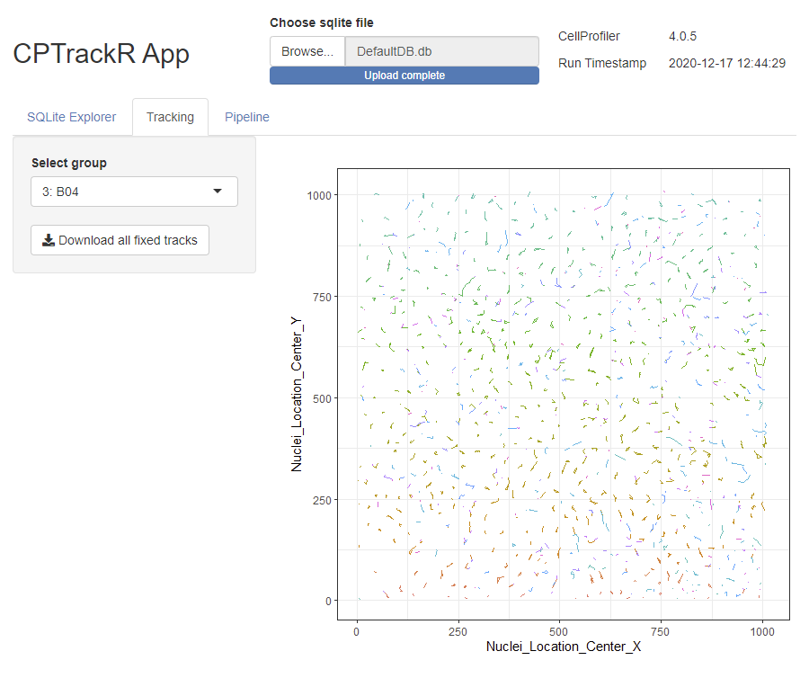

<!-- README.md is generated from README.Rmd. Please edit that file -->

```{r, include = FALSE}
knitr::opts_chunk$set(
  collapse = TRUE,
  comment = "#>",
  fig.path = "man/figures/README-",
  out.width = "100%"
)
```

# CPTrackRApp

<!-- badges: start -->
[](https://www.tidyverse.org/lifecycle/#experimental)
<!-- badges: end -->

## Overview

The goal of CPTrackRApp is to [fix track identifiers](https://forum.image.sc/t/tracking-label/16409) from [CellProfiler](https://cellprofiler.org/)'s sqlite output. CPTrackRApp is a Shiny app that analyses the sqlite file, and determines the parameters for [CPTrackR](https://github.com/burgerga/CPTrackR) to fix the track. 
Additionally it shows the CellProfiler pipeline metadata, and previews the fixed tracks.

## Installation

You can install the development version of CPTrackRApp from with:

```{r, eval=F}
# install.packages("remotes")
remotes::install_github("burgerga/CPTrackRApp")
```

## Usage

To start the app use 

```{r, eval=F}
CPTrackRApp::run_app()
```

**Screenshot:**  

